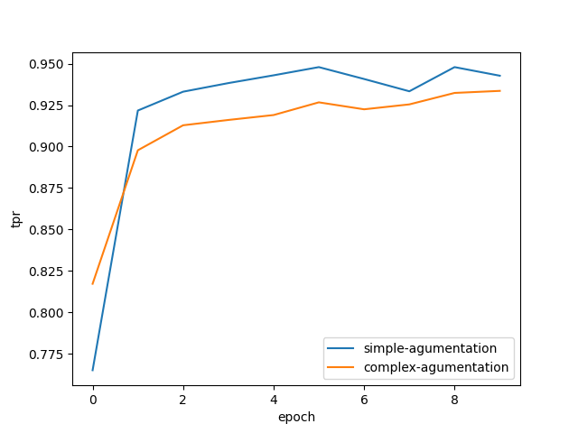
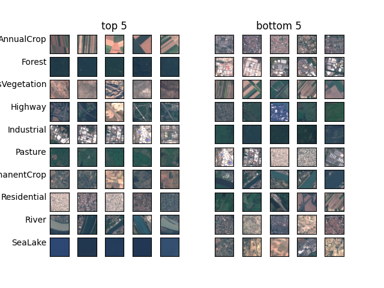
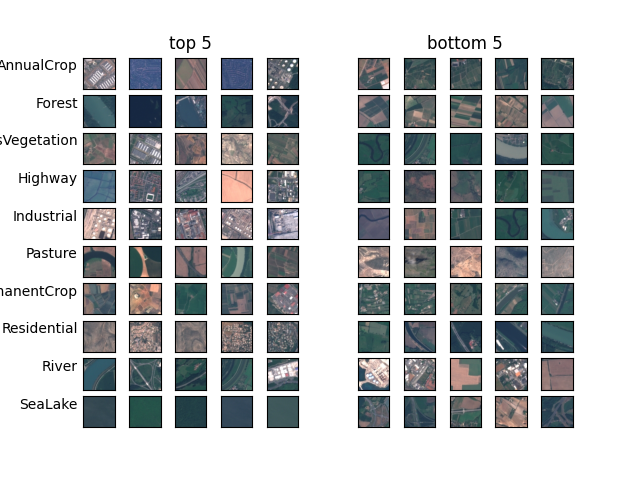
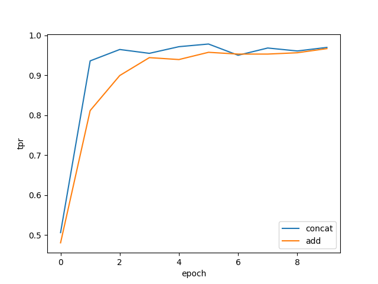
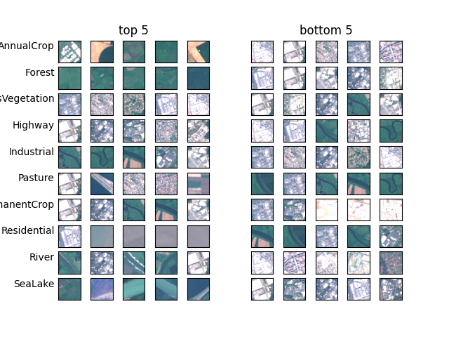
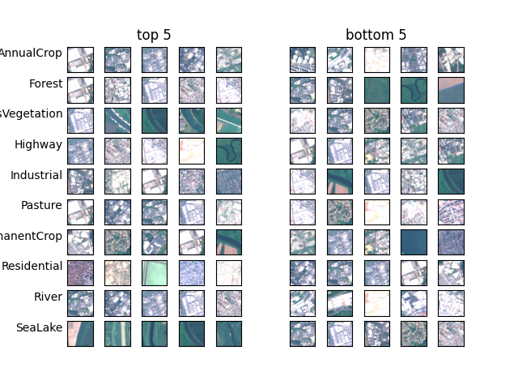

# Packages and Data

## Pip or Conda
### Conda

Install and activate the conda environment with: 

```bash
conda env create -f environment.yml 
conda activate deep-learning
```

### Pip

Install and activate the pip environment with: 

```bash
python3 -m venv .venv
source .venv/bin/activate
pip install -r requirements.txt
```

## Data

Download and unzip the files to `./data`, so that the filestructure is like this: 

```
./data
|-- EuroSAT_MS
|   |-- AnnualCrop
|   |-- Forest
|   |-- HerbaceousVegetation
|   |-- Highway
|   |-- Industrial
|   |-- Pasture
|   |-- PermanentCrop
|   |-- Residential
|   |-- River
|   |-- SeaLake
|-- EuroSAT_RGB
    |-- AnnualCrop
    |-- Forest
    |-- HerbaceousVegetation
    |-- Highway
    |-- Industrial
    |-- Pasture
    |-- PermanentCrop
    |-- Residential
    |-- River
    |-- SeaLake
```


# Splitting Data 

You can either manually create and validate train/val/test splits, 
or skip it, as the training routines automatically create splits and validate them before training a model. 

If you want to manually create splits, you can do this with: 

```bash
# will create splits for ./data/EuroSAT_RGB/
python -m eurosat.utils.data_prep


python -m eurosat.utils.data_prep -d <custom-path>
```

# RGB Training/Testing models 

To train and test the RGB models, run: 

```bash
python -m eurosat.rgb.train

python -m eurosat.rgb.test
```

The training script will train two models: 
One with simple data augmentation, and another one with complex data augmentation. 
Each model is trained for 10 epochs, and the best model is saved in: 
`./models/ms-simple-augmentation.pth`, and `./models/ms-complex-augmentation.pth`
respectively. 
Furthermore, a TPR plot is generated and saved in `./plots/rgb-tpr.png`

The testing script will load both models from the training step and 
evaluate them on the testing split. 
Furthermore, the top/bottom 5 plots are generated for both models and saved under: 
`./plots/rgb-complex-ranking.png`, and `./plots/rgb-simple-ranking.png` respectively. 


# MS Training/Testing models 

The MS training/testing scripts work analogously to the rgb models.
Models can be trained and tested with: 

```bash
python -m eurosat.ms.train

python -m eurosat.ms.test
```

Again Training trains two models. 
The models work for inputs with 6 channels (see `./eurosat/ms/dataset.py`). 
They are again based on Mobilenet with pretrained weights . 
To allow for 6 channels, datapoints are split into two images with 3 channels. 
Mobilenet is then run twice with both parts. 
The two trained models differ in how they put both outputs back together. 
One model adds both output tensors together before the final classification layer, 
and the other model concatenates the layers. 
The best models of training are saved in `./models/ms-add.pth` and 
`./models/ms-concat.pth` respectively. 

Training also creates a tpr plot for both models in 
`./plots/ms-tpr.png`

Test again evaluates the models against the test set. 
It creates top/bottom 5 plots under: 
`./plots/ms-concat-ranking.png` and 
`./plots/ms-add-ranking.png` respectively


# Reproduction Routine

When running the test routines the logits are saved in 
`./models/ms-add-test-logits.pth`,  `./models/ms-concat-test-logits.pth`,
`./models/rgb-complex-augmentation.pth`,  `./models/rgb-simple-augmentation.pth`.
When the logits are not present they are automatically saved. 
If the logits are already saved, then the current test logits are compared to 
the saved logits (prints the sum of difference). 
You can also specify that the logits should be saved with: 
`python -m eurosat.ms.test -s`.

The test dataset is evaluated with a dataloader that has `shuffle=False`, 
thus the order filename of the logit n is found in line n in `./data/EuroSAT_{MS,RGB}/test.txt`.


# Model Report


## RGB Models 








## MS Models








# Authors
Filius, Hans Felix - **Matrikelnummer**: 3773660
Horn, Falko - **Matrikelnummer**: 3736695
Lambert-Hartmann, Jacob - **Matrikelnummer**: 

